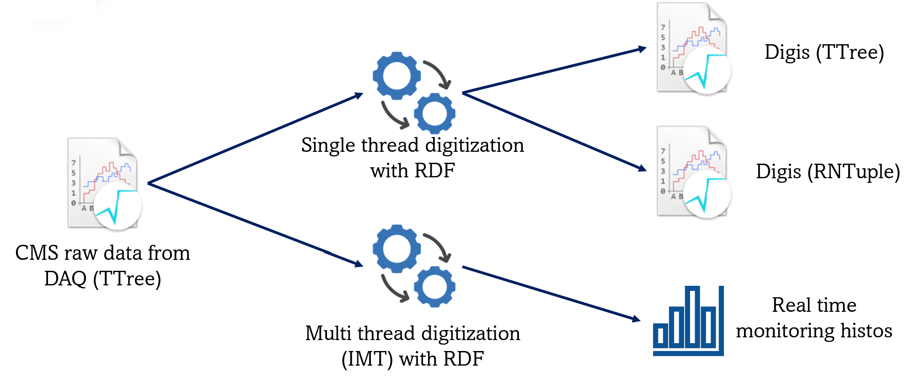

# sndhllhc-raw-to-digi

Performs standalone raw-to-digi conversion and real-time data quality monitoring for silicon strip (SiStrip) data in the SND@HL-LHC experiment.
Input raw data is produced by CMS DAQ. Currently only Zero Suppressed DAQ mode (used for physics) is supported.
<p align="center">
  
</p>
## Features

- SiStrip raw-to-digi conversion
- Real-time data quality monitoring
- Dump info from raw data

## Dependencies

- ROOT 6.36 or later

## Project Structure
- `sistrip_io/` – Input/output classes for ROOT dictionary generation
- `raw_info/` – Tools to inspect and dump raw data information
- `raw_to_digi/` – Raw-to-digi conversion and real-time monitoring code
- `tests/` – CTest-based validation against reference CMSSW datasets
- `docs/` – Additional documentation
- `Dockerfile` – Containerized build environment

## Build instructions
```
cd sndhllhc-raw-to-digi
mkdir build
cd build
cmake ..
cmake --build .
ctest # optionally
```

## Run instructions
### SiStrip raw-to-digi conversion
`./bin/raw_to_digi <input_root_file> <detector_info> <output_root_file>`  
For example:  
`./bin/raw_to_digi tests/data/run_1000779_raw.root tests/data/detector_info.csv tests/data/run_1000779_digi.root`
### Real-time data quality monitoring
`./bin/real_time_monitoring <input_root_file> <detector_info> <output_root_file> <n_treads>`  
For example:  
`./bin/real_time_monitoring tests/data/run_1000779_raw.root tests/data/detector_info.csv tests/data/histos.root 2`
### Dump info from raw data
`./bin/raw_info_dump <input_root_file>`  
For example:  
`./bin/raw_info_dump tests/data/run_1000779_raw.root`
