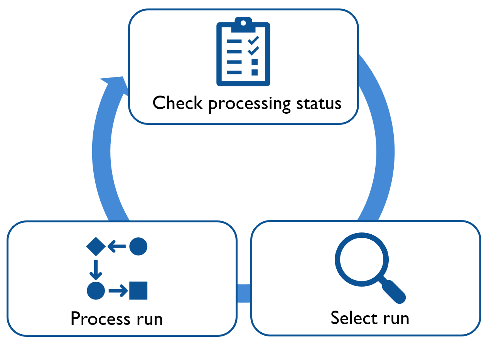

# sndhllhc-raw-to-digi

Performs standalone raw-to-digi conversion and real-time data quality monitoring for silicon strip (SiStrip) data in the SND@HL-LHC experiment.
Input raw data is produced by CMS DAQ. Currently only Zero Suppressed DAQ mode (used for physics) is supported.
<p align="center">
  
  <p align="center"><em>Raw to digi data processing pipeline</em></p>
</p>

<p align="center">
  
  <p align="center"><em>Monitoring daemon for real-time data processing</em></p>
</p>

## Features

- SiStrip raw-to-digi conversion
- Real-time data quality monitoring
- Dump info from raw data
- Build raw events
- Monitoring daemon for real-time data processing pipeline

## Dependencies
### Minimal
- `CMake` 3.23 or later
- [ROOT](https://root.cern.ch/) 6.36 or later
### Raw event building (optional)
- [CMSSW](https://github.com/cms-sw/cmssw) 15.3.0 or later
### Monitoring daemon (optional)
- `python` with `pandas`

## Project Structure
- `sistrip_io/` – Input/output classes for ROOT dictionary generation
- `raw_info/` – Tools to inspect and dump raw data information
- `raw_to_digi/` – Raw-to-digi conversion and real-time monitoring code
- `tests/` – CTest-based validation against reference CMSSW datasets
- `python/` – CMSSW raw event builder configuration and monitoring daemon
- `docs/` – Additional documentation
- `Dockerfile` – Containerized build environment

## Build instructions
```
cd sndhllhc-raw-to-digi
mkdir build
cd build
cmake ..
cmake --build .
ctest # optionally
```

## Run instructions
### SiStrip raw-to-digi conversion
```
./bin/raw_to_digi <input_root_file> <detector_info> <output_root_file> <format: ttree|rntuple>
``` 
For example:  
```
./bin/raw_to_digi tests/data/run_000375_raw.root tests/data/detector_info_tb_5_2026.csv tests/data/run_000375_digi.root rntuple
```
### Real-time data quality monitoring
```
./bin/real_time_monitoring <input_root_file> <detector_info> <geometry_file> <output_histos_root_file> <n_treads>
```
For example:  
```
./bin/real_time_monitoring tests/data/run000375_digi_rntuple.root tests/data/detector_info_tb_5_2026.csv tests/data/geofile_testbeam_2026.root tests/data/histos.root 2
```
### Dump info from raw data
```
./bin/raw_info_dump <input_root_file>
```
For example:  
```
./bin/raw_info_dump tests/data/run_00375_raw.root
```
### Monitoring daemon
NOTE: requires CMSSW if raw events are not built already  
```
python processing_pipeline.py
```
